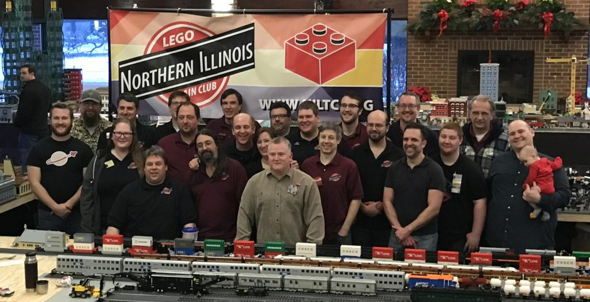
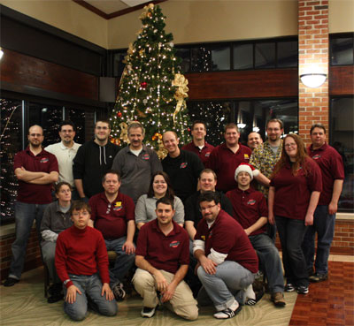

## Mission Statement

  
NILTC is an independent, self-sustaining, private organization, dedicated to providing members a platform in which to explore the LEGO hobby with each other and share their creations with the public.

**Who are NILTC?**

NILTC is an adult LEGO® enthusiast group of 25 active members that enjoy building, designing, and displaying LEGO® creations for the public. NILTC is unique in the LEGO® train club universe in that all members are encouraged to create in what ever genre they love: town, space, city, castle, Star Wars, Harry Potter, etc. The train is used to connect all the different areas together into a cohesive train display with characters from one often bleeding into other areas in a humorous manner. NILTC also excels at little vignettes throughout their layout that often get lots of attention and big laughs from the adoring crowd.

<figure id="attachment_942" class="wp-caption aligncenter" aria-describedby="caption-attachment-942" style="width: 1024px">

<figcaption>Cantigny – December 2016</figcaption>
</figure>

<figure id="attachment_129" class="wp-caption aligncenter" aria-describedby="caption-attachment-129" style="width: 400px">

<figcaption>Cantigny – December 2010</figcaption>
</figure>

 

**Club History**

NILTC started out in late summer of 2001 as a meeting of a few LEGO® enthusiasts from Illinois and Wisconsin. One member had been displaying a small LEGO® train creation locally and it was thought that a larger, more involved display would be challenging and fun. From there, NILTC was born. A logo was chosen, building parameters agreed upon, and preparations began for their first show the following March.

Consisting of only five members, NILTC put up an impressive 17ft. x 22ft. display at the National Model Railroad Association’s High Wheeler Show at Harper College in Palatine Illinois in early 2002. Reactions were extremely positive and the members were bombarded by the reoccurring question: “I didn’t know LEGO® made trains”! NILTC gained three additional members from the show, an unexpected bonus! From the show at Harper College, NILTC was asked by the local chapter of the Train Collectors Association (TCA) to display at their national show in St. Charles, Illinois later that year. Having very limited space, the TCA only invited the regions best clubs and layouts to the show. NILTC was honored to represent “L” gauge and to educate an audience of extreme train enthusiasts who had no idea that LEGO® was a train force to be reckoned with. Two more members were added from this show – another unexpected bonus!

NILTC’s largest attendance at a show to date was in 2003 for the Illinois Railway Museum’s “Day Out With Thomas” in Union, Illinois. Over two weekends, NILTC members manned our own 40ft. x 40ft. tent with an enormous 30ft. x 30ft. display while 48,000 guests milled around, explored, and applauded the mini world that was created for their enjoyment by NILTC!

Over the past 11 years, NILTC has been the main attraction at Cantigny Park in Wheaton, Illinois for their annual Christmas LEGO® Train Show. The show started out as a way to bring patrons into the park on the off-season, but has grown into an event all by itself with the attendance in 2011 in excess of 10,800 people.

NILTC currently displays six to seven times a year at various venues and public libraries throughout the Chicagoland suburbs.

Contact Us: <niltc.contact@gmail.com>
