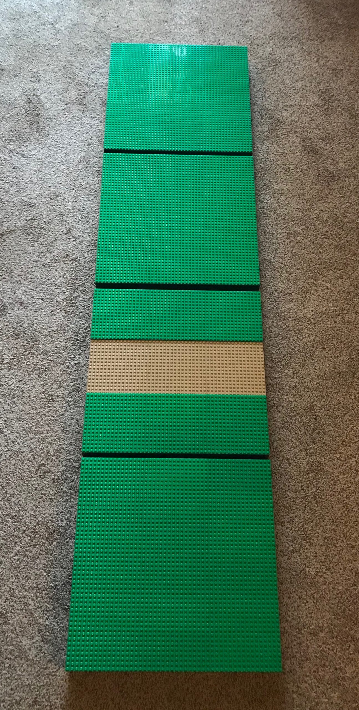
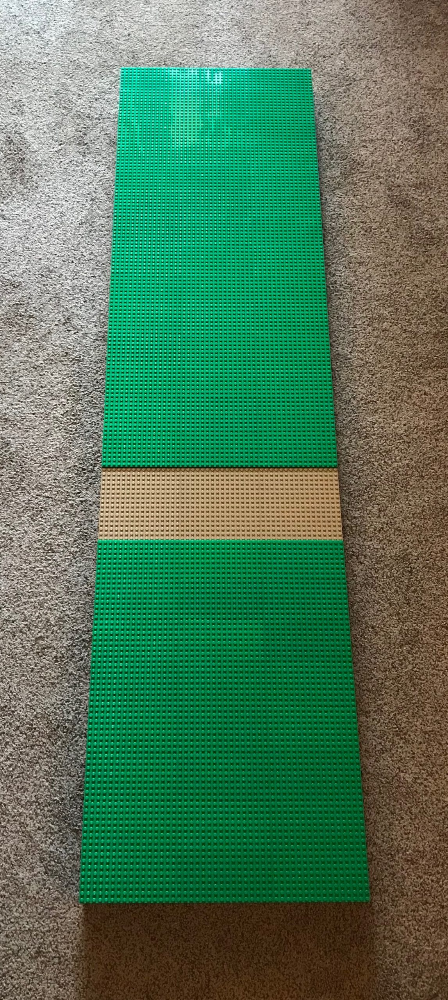
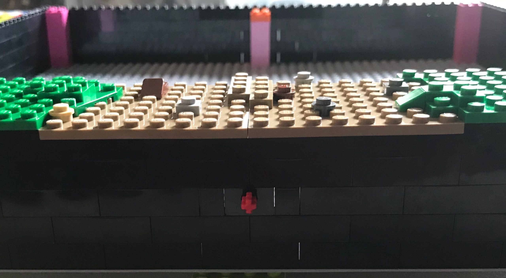
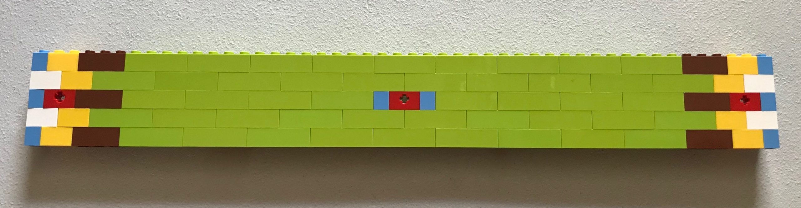
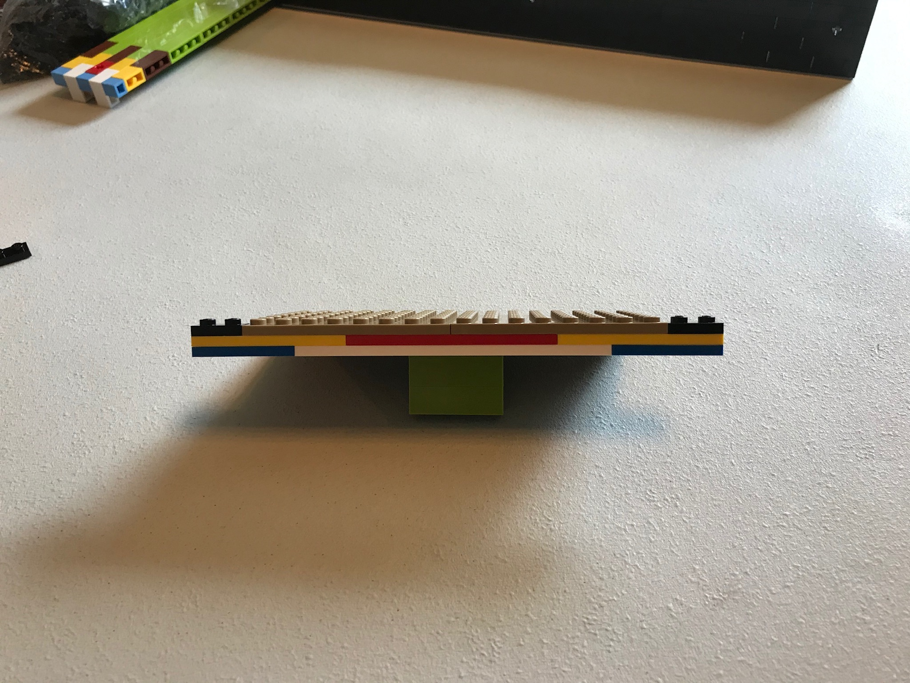

The whole idea behind this is to create a multi-member collaborative layout using minimal standards, that ANYONE can build for and join, but from a distance will appear as one cohesive display.

Too many times I hear from members, they just don’t know what to build. Well, here’s a springboard, you just make it your own.

The collaborative would be an NILTC member group built layout that would be displayed as a standalone display. The modules could also be taken to other shows and displayed at Nebraska Brick Days, Brickfair Virginia, or used at a Virtual Brickworld show.

Oftentimes, people see our logo and think we are only a train club. We know we aren’t just one thing, but by having this at our shows, we can show we aren’t single minded and could use this as a recruiting tool.

As members are not always able to participate in every show, the standards are designed so modules can be brought and added to the display without affecting the overall appearance of the display.

Standards:  
These standards are designed for extreme flexibility when creating the display and minimal planning. The standards will be heavily enforced or the display will not function properly.

All modules are 15” wide by 60” deep. If you have the time and brick, feel free to make a double-wide module, 30” wide by 60” deep. 15”, 30”, 45”, even 60” wide, whatever works best for you.  
The road is one of the key features of this display. The connection points are on the 17th through 32nd studs of the third module down. If your module is wide enough and you want to add some bend in the road, go for it! As long as it realigns for the next module.

All modules must be designed to be independent of their neighbors’ modules. This will ensure that no members’ modules are dependent on another members’ module and will make planning and design extremely simple. Example; you may not have a creek running from left to right in your module as once you contact your neighbors module…the creek would have to abruptly end.

Each module (ideally) will consist of four sub modules. Viewing a module from the top down (following the 60” length) there would be a standard sub module, a second standard sub module, a road sub module, and a third standard sub module at the bottom.

|  |  |
|----|----|
|  |  |

The main terrain colors will be green (old baseplate green, green on Bricklink, dark green according to LEGO) for the grass and dark tan (dark tan on Bricklink, Sand Yellow according to LEGO) for the roadway. If you choose to mix in brown for muddy grass, awesome. Just be sure to fade back to all green at the last stud to tie in to the standard. Adding rocks and dirt or overgrowth to the road is fine, again, just be sure to fade back to the proper connection points at the edge of the module.

Module sidewalls are to be 5 bricks/15 plates high, built of all black brick, with 3 Technic 1×2 bricks w/ axle hole per side. These will be placed on the third brick level (plates 7-9 up from the baseplate) on studs 2 & 3, studs 24 & 25, and studs 46 & 47.

Grass/terrain height is set at the 16th plate up from the base.

Road height is set at the 15th plate up from the base.

|                                                     |
|-----------------------------------------------------|
|  |

Minifigures (humans) will be yellow figures, no fleshies. The one and only exception to this would be the Elves Minidoll figures. Trolls, Orcs, Elves, Bear People (Chima), Dwarves; all are allowed.

Fantasy elements are allowed. Dragons, creatures, magic, whatever. Have fun with it.

Humor, go for it! Be sensible though, if it becomes an issue, it may have to be removed.

So these are the nine standards we have set in place for this to work. Questions, please ask.

Suggestions on how to get started

  
Simple template for building one side of a sub module. Multiple colors used for simplification, but this should be in all black brick.  

|                                                     |
|-----------------------------------------------------|
|  |

  
For a standard sub module (3 per module)…  
(20x) 1×1 brick medium blue  
(32x) 1×2 brick yellow  
(24x) 1×3 brick reddish brown  
(46x) 1×4 brick lime green  
(12x) 1×2 technic brick red  
(8x) 2×2 corner brick white

Simplified template for adjusting for the road placement. Multiple colors used for simplification, but this should be in all black plate (except the dark tan road).  

|                                             |
|---------------------------------------------|
|  |

  
For a road sub module (1 per module)…  
(4x) 1×2 plate black  
(4x) 1×4 plate blue  
(4x) 1×6 plate yellow  
(2x) 1×8 plate red  
(2x) 1×12 plate white

And…

(20x) 1×1 brick medium blue  
(32x) 1×2 brick yellow  
(24x) 1×3 brick reddish brown  
(36x) 1×4 brick lime green  
(12x) 1×2 technic brick red  
(8x) 2×2 corner brick white

Leave off 5 of the top centered 1×4 bricks on opposing sides, and place the plate assembly in the 20L space.  
(Picture needed)
