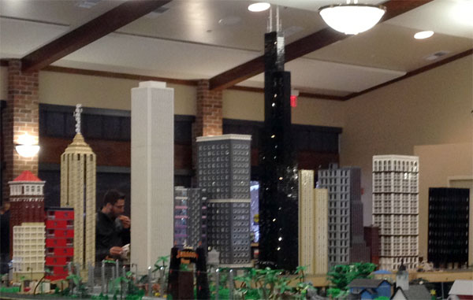

**Height:** Roger’s Sears Tower is 96 inches tall, 108 inches (9 feet) with the antenna. We are on 36 inch tables. Which means when the Sears Tower is displayed with antenna, the top of those antenna are at 144 inches (12 feet) off the ground! Any building you make over 36 inches should be taller than most average people, as this will be topped out at 6 feet. If your structure is larger than 36 inches, please consider adding internal/vertical supports.

**Building Base:** Total base height of the buildings shall be 1 baseplate and 4 levels of plate. 3 of the levels of plate (1 brick) equal the height of the SNOT roadways. The 4th level of plate (top level) is what makes up the sidewalks. The sidewalks attached to the streets (currently Roger’s) are Dark Grey, not Dark Bley, so be aware of this when creating your skyscraper. You can choose to use a different color, but it may clash. We are not tiling the sidewalks on the streets.

**Footprint/Area:** Skyscraper footprints will be based off multiples of 32×32, or a standard baseplate. This means 32×32, 32×64, 64×64 are all ideal footprints. If you are considering an odd/different size, please speak with a coordinator as we can assess if the build can be worked into the display. Please remember to contain all aspects of your building within the footprint/area of your design. Architectural details such as ledges, corners, and other building detail should all remain within the footprint of your build so as not to disturb the adjacent builds. City block size will be determined before each show and will be either 64×64 or 96×96.

**Protrusions:** ‘IF’ you decide to add awnings, window sills, or other items that will extend out over your building footprint, these shall be limited to the front face of your structure. If you are considering 2 adjacent sides for your skyscraper addons, please speak with a coordinator as we can work the needs into the layout. Don’t forget, jumper plates can have an incredible effect when used properly.

**Lighting:** Please feel free to add lighting to your structures. Remember to design an easy access hatch of some type for quick battery changes, or plan accordingly for a power outlet. Whether lighting your builds or not, consider blocking out/blacking out windows. This can change the appearance of your build, create a unique lighting effect, and add to the overall strength of the build.

**Color:** Feel free to create your own color scheme as you see fit. This is a LEGO City; the color palette is pretty expansive. Wild color combinations and creativity is highly encouraged!

**Additional Builds:** Cities do not just consist of skyscrapers. We encourage additional builds. If you do not have large quantities of brick for constructing a skyscraper, feel free to create a park, fountain, parking lot, Picasso, rundown lot…etc…These additions can really bring things to life and show so many additional aspects of a city.
